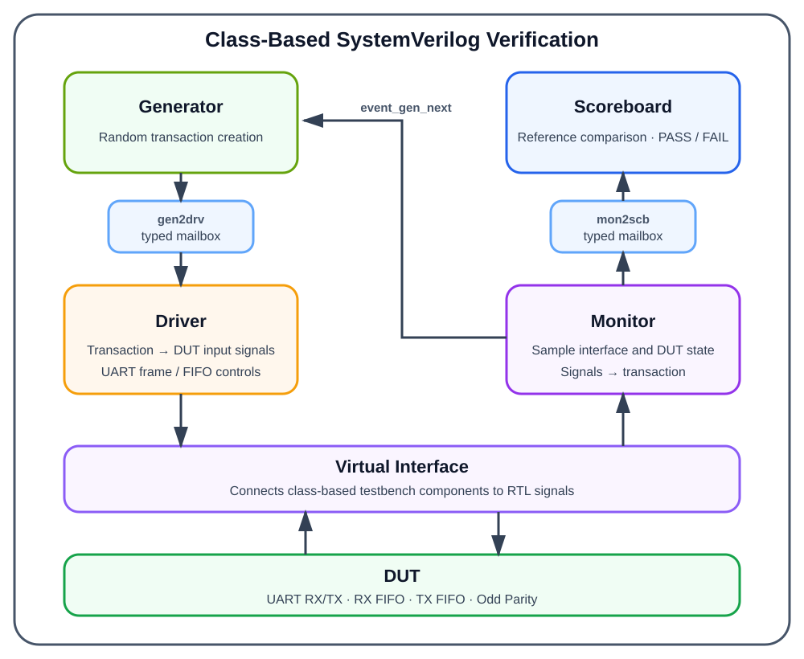

# SystemVerilog UART + FIFO Verification

UART TX/RX, dual FIFO, Odd Parity를 결합한 Loopback DUT와 **class-based SystemVerilog verification environment**입니다. Transaction, Generator, Driver, Monitor, Scoreboard를 분리하고 mailbox와 event로 연결하여 FIFO 데이터 순서, UART frame, parity error 및 오류 데이터 차단 동작을 검증했습니다.

> 개인 프로젝트 · 2026.05.12 - 2026.05.18 · SystemVerilog · Xilinx Vivado

## Verification Architecture



Generator가 randomized transaction을 만들고 Driver가 DUT 입력 신호로 변환합니다. Monitor는 interface와 DUT 내부 상태를 sampling해 transaction으로 재구성하며, Scoreboard가 기대값과 실제값을 비교합니다. Generator-Driver와 Monitor-Scoreboard는 typed mailbox로 연결하고, 다음 stimulus 진행은 event로 동기화했습니다.

## DUT Overview

- 100 MHz system clock, 9,600 bps UART, 16x oversampling
- `IDLE / START / DATA / PARITY / STOP` 상태의 UART RX/TX FSM
- 8-bit, 16-entry circular FIFO와 `full` / `empty` 제어
- `UART RX → RX FIFO → TX FIFO → UART TX` loopback data path
- Odd Parity 생성·검출
- `rx_done & ~parity_error` 조건을 이용한 오류 데이터 RX FIFO push 차단

## Verification Environment

| Component | Role |
|---|---|
| Transaction | Random stimulus와 관찰 결과를 담는 data object |
| Generator | `rand` 데이터, Push/Pop 및 parity error injection 생성 |
| Driver | FIFO control 또는 UART serial frame을 DUT에 인가 |
| Monitor | UART/FIFO data와 timing signal을 sampling |
| Scoreboard | Queue/reference data와 DUT 결과를 자동 비교 |
| Environment | Component, mailbox, event와 test sequence 통합 |

이 구조는 UVM 라이브러리를 사용하지 않고 SystemVerilog class, virtual interface, mailbox, event로 직접 구성했습니다.

## Test Scenarios

| Target | Scenarios | Check |
|---|---|---|
| FIFO | Reset, 16회 Push Only, 16회 Pop Only, 100회 Random Push/Pop | `empty/full`, FIFO 순서, overflow/underflow guard |
| UART Loopback | 6개 random 8-bit frame 송수신 | RX 복원값, TX 재전송값, stop bit, `rx_done/tx_busy` timing |
| UART + FIFO | 10개 random data/parity-error transaction | RX FIFO 전달, TX FIFO 전달, TX serial data, parity 및 stop bit |
| Error Handling | Random parity bit inversion | `parity_error` 검출, RX FIFO push 차단, `tx_busy == 0` |

Reset 상태는 immediate assertion으로 확인하고, 데이터 경로는 Monitor가 수집한 결과를 Scoreboard에서 PASS/FAIL로 자동 판정합니다.

## My Work

개인 프로젝트로 다음 항목을 직접 설계하고 검증했습니다.

- UART TX/RX FSM, baud tick generator와 16x oversampling 구조
- 16-entry FIFO RTL과 Push/Pop, Full/Empty control logic
- RX FIFO와 TX FIFO를 포함한 UART loopback 통합
- Odd Parity 생성·검출과 random parity-error injection
- Parity error 발생 시 오류 데이터의 FIFO/TX 경로 차단
- Transaction, Generator, Driver, Monitor, Scoreboard 기반 testbench
- Waveform 기반 timing 분석과 Start-bit sampling 및 parity blocking 문제 해결

## Troubleshooting

- Start bit sampling 시점 때문에 RX data가 한 bit씩 밀리는 문제를 16x oversampling과 중앙 sampling 기준으로 수정했습니다.
- Parity 오류 데이터가 TX까지 전달되던 문제를 RX FIFO push 조건에 `~parity_error`를 추가해 차단했습니다.

## Source Structure

| Path | Description |
|---|---|
| `dut/fifo_sv.sv` | 16-entry FIFO, register file, pointer/control unit |
| `dut/uart_loopback_sv.sv` | UART loopback, RX/TX FSM, baud tick generator |
| `dut/uart_fifo_loopback_sv.sv` | UART, RX FIFO, TX FIFO 통합 top |
| `tb/tb_fifo_sv.sv` | FIFO class-based random verification |
| `tb/tb_uart_sv.sv` | UART loopback random verification |
| `tb/tb_uart_fifo_loopback_sv.sv` | UART + FIFO + Parity 통합 verification |

## Simulation Sets

각 testbench가 같은 class 이름을 독립적으로 정의하므로 아래 세 simulation set을 **각각 따로** compile해야 합니다.

1. FIFO: `dut/fifo_sv.sv` + `tb/tb_fifo_sv.sv`
2. UART Loopback: `dut/uart_loopback_sv.sv` + `tb/tb_uart_sv.sv`
3. Integrated Loopback: `dut/fifo_sv.sv` + `dut/uart_loopback_sv.sv` + `dut/uart_fifo_loopback_sv.sv` + `tb/tb_uart_fifo_loopback_sv.sv`

## Reproduction Notes and Limitations

- Testbench는 DUT 내부 신호를 hierarchical reference로 관찰하므로 module hierarchy를 유지해야 합니다.
- 이 공개 스냅샷에는 Vivado project/cache, waveform database, 개발일지, 일정표, 발표 자료와 전체 보고서를 포함하지 않았습니다.
- FPGA 보드 실장, 외부 serial device, noise, baud mismatch, frame/overrun error 검증은 범위에 포함하지 않았습니다.
- Concurrent SVA property, Functional Coverage, Code Coverage 및 UVM은 구현 범위가 아니라 향후 개선 항목입니다.

## Project Layout

```text
systemverilog-uart-fifo-verification/
├── assets/
│   └── verification-architecture.svg
├── dut/
│   ├── fifo_sv.sv
│   ├── uart_fifo_loopback_sv.sv
│   └── uart_loopback_sv.sv
├── tb/
│   ├── tb_fifo_sv.sv
│   ├── tb_uart_fifo_loopback_sv.sv
│   └── tb_uart_sv.sv
├── .gitignore
└── README.md
```
