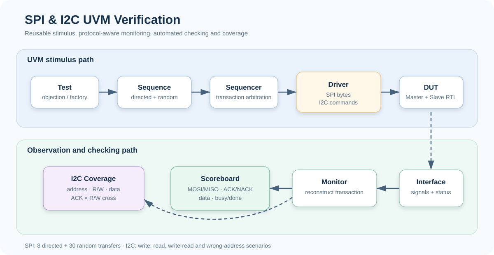

# SPI & I2C UVM Verification


SystemVerilog로 SPI/I2C RTL을 직접 설계하고, UVM 환경에서 자동 검증한 뒤 SPI를 Basys3 FPGA에서 실측한 프로젝트입니다.

## Highlights

| Area | Implementation |
|---|---|
| SPI RTL | 8-bit Mode 0 Master/Slave, full-duplex MOSI/MISO, programmable clock divider, loopback top |
| I2C RTL | START/STOP, Write/Read, ACK/NACK, address match, open-drain SDA |
| UVM | Sequence Item, Sequence, Sequencer, Driver, Monitor, Agent, Environment, Test, Factory, Config DB |
| Self-checking | Analysis Port/Imp, scoreboard PASS/FAIL, protocol status checks |
| Coverage | I2C ACK/NACK, address match, R/W mode, data bins, ACK × R/W cross |
| Hardware | Basys3 Master/Slave wrappers, button debounce, LED/FND status, logic-analyzer validation |

## Architecture



The UVM test creates transactions through a sequencer/driver path. The monitor reconstructs completed transfers and broadcasts them through analysis ports to the scoreboard; the I2C environment also samples functional coverage.

## Verification Scenarios

| Target | Stimulus | Automated Checks |
|---|---|---|
| SPI directed | 8 pattern pairs: `AA/11`, `55/22`, `00/33`, `FF/44`, `0F/55`, `F0/66`, `A5/77`, `5A/88` | MOSI/MISO data integrity and Master/Slave busy/done state |
| SPI random | 30 randomized Master/Slave byte pairs | Full-duplex receive data against both transmitted bytes |
| I2C write | Address `0x50`, data `0xA5` | Write ACK and Slave receive data |
| I2C read | Address `0x50`, Slave data `0x3C` | Master receive data and final NACK |
| I2C write-read | Write `0x5A`, then read `0xC3` | Direction transition, write/read data, ACK/NACK |
| I2C wrong address | DUT `0x50`, request `0x51` | Address mismatch and NACK |

## Results

The submitted final report records:

| Target | Result | Meaning |
|---|---:|---|
| SPI | **38 PASS / 0 FAIL** | 8 directed + 30 randomized transfers passed the scoreboard |
| I2C | **7 PASS / 0 FAIL** | Seven protocol/data checks passed across the four sequence scenarios |
| FPGA SPI | **Observed normal** | SS_N, SCLK, MOSI and MISO were checked with a logic analyzer |

> Evidence note: the counts above come from the submitted report and captured simulator output; raw simulator logs were not bundled. The provided source defines functional coverage in the I2C UVM environment. The SPI source is scoreboard-based, so the report's separate SPI coverage percentage is not presented here as a reproducible metric.

## Troubleshooting Applied

- Stabilized FPGA SPI decoding by changing the board clock divider from `8'd4` to `8'd100`.
- Fixed the first MISO-bit timing by presenting `tx_data[7]` immediately when `SS_N` falls.
- Implemented I2C SDA as open drain: logic `1` releases the line to `Z`; logic `0` drives it low.
- Delayed SPI monitor sampling by `#1` after the start edge to observe RTL nonblocking-assignment updates correctly.

## Repository Structure

```text
.
├── rtl
│   ├── spi          # SPI Master, Slave and simulation loopback
│   └── i2c          # I2C Master, Slave and connected top
├── fpga             # Basys3 demo wrappers, control IP and FND display
├── tb               # SPI and I2C UVM testbenches
├── sim              # Compile-order file lists
└── assets           # Portfolio architecture diagram
```

## Run

The testbenches target a SystemVerilog simulator with UVM 1.2. Example VCS commands from the repository root:

```bash
vcs -full64 -sverilog -ntb_opts uvm-1.2 -f sim/spi.f \
  -top tb_top_spi_loopback -debug_access+all -o simv_spi
./simv_spi

vcs -full64 -sverilog -ntb_opts uvm-1.2 -f sim/i2c.f \
  -top tb_top -debug_access+all -o simv_i2c
./simv_i2c
```

The testbenches call `$fsdbDump*`; enable the Verdi FSDB PLI in the local simulator setup, or remove those dump blocks when using another waveform format.

## Current Scope

- SPI is limited to one Master, one Slave and Mode 0.
- I2C does not yet cover multi-master arbitration, clock stretching, multiple Slaves or external sensors.
- Next verification steps are SVA protocol properties, code coverage, coverage closure, SPI CPOL/CPHA modes and I2C repeated START.

